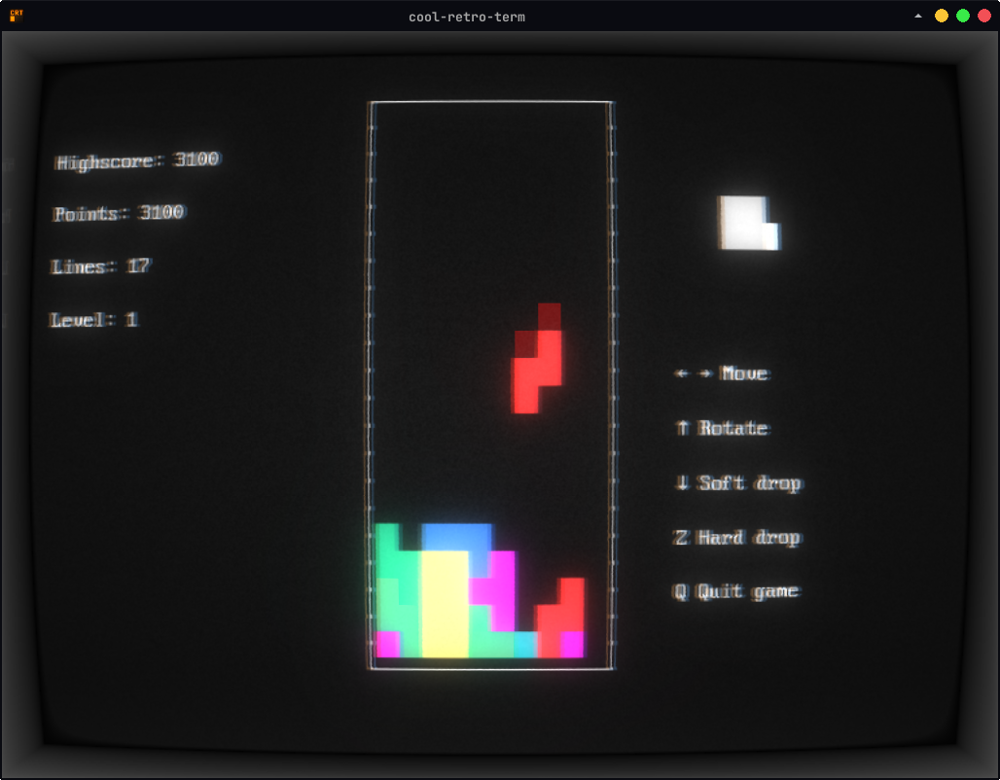

<!-- markdownlint-disable MD033 -->

# termtris



Command-line [tetris](https://en.wikipedia.org/wiki/Tetris) game made with the [Lua](https://www.lua.org/) programming language using [lcurses](https://github.com/lcurses/lcurses) binding for [curses library](https://en.wikipedia.org/wiki/Curses_%28programming_library%29).

## Installation

### Linux

```bash
sudo apt install lua5.3 luarocks git && \
sudo luarocks install lcurses && \
git clone https://github.com/Ibrahimbag/termtris.git && \
cd termtris && \
lua main.lua
```
